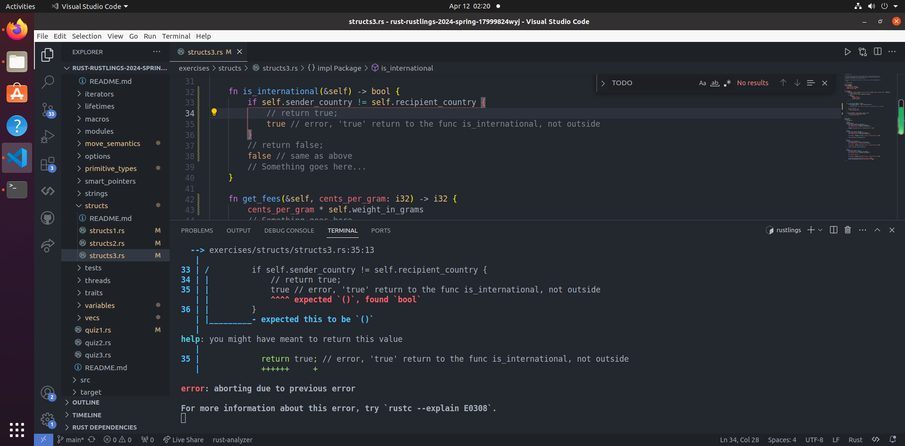
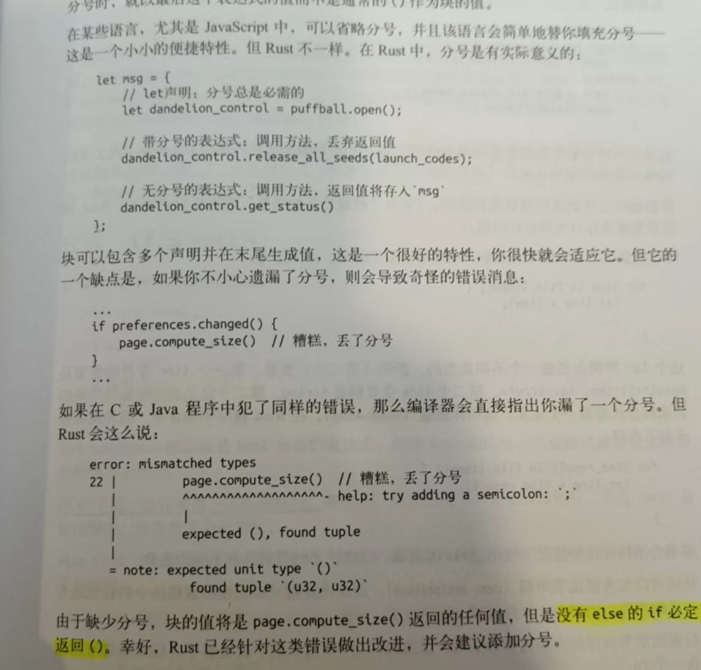

# Rust OS 一阶段学习总结
@FinishTime: 2024-04-23 00:35:51
## 个人背景概述
我是一名软件工程专业的大二本科生，曾参与过2023年秋冬季训练营。  
在去年的训练营中，我学习了rust，但因为第一次学习，且当时需要准备期中考试和各科作业，没有按时通过第一阶段。  
虽然我后续进入了二阶段群，但没有完成第二阶段的实验部分，今年重新参与，打算认真跟进下去。

## 今年一阶段学习时间表
- 2024-03-27 重新报名参与活动，并邀请了一名本校大三学长共同进步
- 2024-04-07 正式开始参与活动，又邀请了两位同校同学，我开始重新复习rust
- 2024-04-12 通过rust圣经复习至基础部分完成，开始进行做题
- 2024-04-13 累计做题3小时，做至43题
- 2024-04-19 进行到cow指针部分
- 2024-04-20 完成前100题
- 2024-04-21 完成110题，开始提交

## 一阶段学习内容概述
我按照[“rust语言圣经”](https://course.rs/about-book.html)上的讲解顺序进行学习，分别学习了：
- 变量的绑定与解构
- 基本类型
- 所有权和借用
- 复合类型
- 流程控制
- 模式匹配
- 方法
- 泛型和特征
- 集合类型
- 生命周期
- 返回值、错误处理
- 包和模块
- 注释和文档
- 格式化输出
- 智能指针
- 多线程
- 闭包与迭代器
- 宏编程
- unsafe rust

## 问题概述
在一阶段过程中，我遇到了一定的问题，并尝试进行解决。以下内容是我认为，不是那么“较为基础”的问题。
### 2024-04-12 问题：unicode展示
#### 问题描述
在primitive_types2.rs中，注释要求尝试传入unicode字符，来理解rust中的char。  
但是，我通过`https://emojidb.org/rust-emojis`这个[emojis网址](https://emojidb.org/rust-emojis)，拿到了一个emoji：☢️，进行测试，却直接编译出错：  

#### 出错代码
```rust
// primitive_types2.rs
//
// Fill in the rest of the line that has code missing! No hints, there's no
// tricks, just get used to typing these :)
//
// Execute `rustlings hint primitive_types2` or use the `hint` watch subcommand
// for a hint.


fn main() {
    // Characters (`char`)

    // Note the _single_ quotes, these are different from the double quotes
    // you've been seeing around.
    let my_first_initial = 'C';
    if my_first_initial.is_alphabetic() {
        println!("Alphabetical!");
    } else if my_first_initial.is_numeric() {
        println!("Numerical!");
    } else {
        println!("Neither alphabetic nor numeric!");
    }

    let your_character = '☢️'; // Finish this line like the example! What's your favorite character?
    // Try a letter, try a number, try a special character, try a character
    // from a different language than your own, try an emoji!
    if your_character.is_alphabetic() {
        println!("Alphabetical!");
    } else if your_character.is_numeric() {
        println!("Numerical!");
    } else {
        println!("Neither alphabetic nor numeric!");
    }
}
```
#### 问题分析
我与队伍里的成员们进行了初步的实验和讨论，确定报错的原因是：“☢️”无法被解析成字符，必须被解析成字符串。那么，问题来了，为什么它无法被解析成字符，而其它的unicode码可以被解析成字符？

#### 解决方法
首先，我们进行了实验，从[emojis网站](https://emojidb.org/rust-emojis)中寻找了其他的emoji字符，发现大部分的emoji竟然都能被解析成字符。那问题就是出在“☢️”这个emoji上。

我们队内通过查找rust官方的文档，发现，文档中说，unicode码被分为了两大类，一类是UTF-16，一类是UTF-8。  
那么，这两大类的unicode字符有什么区别？  
我们通过搜集资料、询问ai等方式，得到：
> UTF-16码点在0xD800到0xDFFF的范围内  
> UTF-8码点在0x80到0x10FFFF的范围内  
> 如图  
> 如图

我们的总结是：UTF-8是8位的，其由一个字节进行表示，而UTF-16是16位的，其由两个字节进行表示，很可能是因为“☢️”是UTF-16编码，导致其无法被解析成rust里的“字符`char`”。

### 2024-04-12 问题：if内部返回异常
#### 问题描述
在编程的过程中，我意外发现，在if语句内，通过不写分号的方式进行返回，会产生问题，程序无法编译，见下图：  



#### 出错代码
```rust
// structs3.rs
//
// Structs contain data, but can also have logic. In this exercise we have
// defined the Package struct and we want to test some logic attached to it.
// Make the code compile and the tests pass!
//
// Execute `rustlings hint structs3` or use the `hint` watch subcommand for a
// hint.

#[derive(Debug)]
struct Package {
    sender_country: String,
    recipient_country: String,
    weight_in_grams: i32,
}

impl Package {
    fn new(sender_country: String, recipient_country: String, weight_in_grams: i32) -> Package {
        if weight_in_grams <= 0 {
            panic!("Can not ship a weightless package.")
        } else {
            Package {
                sender_country,
                recipient_country,
                weight_in_grams,
            }
        }
    }

    fn is_international(&self) -> bool {
        // if self.sender_country != self.recipient_country {
        //     return true;
        //     // true // error, 'true' return to the func is_international, not outside
        // }
        // // return false;
        // false // it can pass the compile

        // if self.sender_country == self.recipient_country {
        //     false
        // } else {
        //     true
        // }

        self.sender_country != self.recipient_country // most elegent way
    }

    fn get_fees(&self, cents_per_gram: i32) -> i32 {
        cents_per_gram * self.weight_in_grams
        // Something goes here...
    }
}

#[cfg(test)]
mod tests {
    use super::*;

    #[test]
    #[should_panic]
    fn fail_creating_weightless_package() {
        let sender_country = String::from("Spain");
        let recipient_country = String::from("Austria");

        Package::new(sender_country, recipient_country, -2210);
    }

    #[test]
    fn create_international_package() {
        let sender_country = String::from("Spain");
        let recipient_country = String::from("Russia");

        let package = Package::new(sender_country, recipient_country, 1200);

        assert!(package.is_international());
    }

    #[test]
    fn create_local_package() {
        let sender_country = String::from("Canada");
        let recipient_country = sender_country.clone();

        let package = Package::new(sender_country, recipient_country, 1200);

        assert!(!package.is_international());
    }

    #[test]
    fn calculate_transport_fees() {
        let sender_country = String::from("Spain");
        let recipient_country = String::from("Spain");

        let cents_per_gram = 3;

        let package = Package::new(sender_country, recipient_country, 1500);

        assert_eq!(package.get_fees(cents_per_gram), 4500);
        assert_eq!(package.get_fees(cents_per_gram * 2), 9000);
    }
}
```

#### 问题分析
在遇到这个问题之后，我自己分析不出来为什么会出现这样的错误。于是，我去找队伍里的学长进行咨询。学长在他的教程书里找到了答案。出现这个问题的原因是，rust的但if语句的返回值必然是返回单元`()`，因此，我不使用return返回true时，破坏了if语句的语法规则，导致出错。具体教程如下：  


## 额外练习
在第一阶段中，我在我们专业的操作系统实验课程中，使用rust编程，完成了实验内容，具体完成了：
- 生产者与消费者问题
- 时间片轮转和优先级队列的调度算法
- 文件系统的实现

## 总结
在第一阶段的学习中，我巩固了我们所掌握的rust基础，并开始学习操作系统相关的知识。在这一部分，我还培养了我的思考能力，深入思考了rust的安全与不安全的地方。同时，通过和群友的交流，我也展开了对更多其它知识点的思考，比如“Copy”、“Clone”特征和“Drop”的冲突之处。  
最重要的是，我深深意识到：`Talk is cheap, show me the code!`

## 展望
目前，我已经开始了第二阶段部分内容的学习，希望可以顺利的完成第二阶段的所有内容。之后参与到第三阶段的项目中，继续提高自己的能力。

# Rust rCore 二阶段学习总结
@FinishTime: 2024-06-01 01:39
## 二阶段学习时间表
- 2024-04-29 二阶段rCore正式开始
- 2024-05-06 用了一周时间，复习完学校的期中考试内容，并且做各种学校里的作业
- 2024-05-10 期中考试完毕，继续写短头课要交的作业
- 2024-05-16 完成学校内的作业，共计：计算机网络1篇论文3000字，iOS开发1篇伪大学生学位论文1.8万字，操作系统实验代码与报告6000字，web开发作业，算法分析与设计实验与报告6000字，人机交互作业报告3000字，毛概发言稿3800字
- 2024-05-17 rCore的ch3完成
- 2024-05-19 官宣二阶段结束，我在大约16：00，完成了ch4，之后一直尝试解决ch5和ch6，最后在晚上23：00，我还没有完成ch6，所以我决定先提交到300分以保证3阶段旁听资格。到23：40左右，我完成了前三部分的提交，获得300分，拿到三阶段旁听资格
- 2024-05-20 一天时间，完成了老师留的数学建模的作业
- 2024-05-21 继续写rCore的ch6，完成了大部分的核心功能代码，测试时，崩掉
- 2024-05-22 两天时间，完成了“工程技术创新方法”的作业报告3000字和汇报ppt
- 2024-05-25 完成了web开发的大作业
- 2024-05-30 完成了rCore的第400分，也就是说，ch6卡了我差不多一整周时间，最后在万能的群友的帮助下成功了
- 2024-05-31 早2：00，完成第500分，剩余一整天时间，完成了前面的所有报告，与本篇记录
## 二阶段学习内容概述
- ch1: 理解rCore的代码的运行环境，以及为什么它能够在裸机上运行起来
- ch2: 实现“让rCore可以接收一系列程序”，即，使rCore变成了一个简单的批处理系统
- ch3: 对rCore进行升级，使其变为分时系统
- ch4: 扩充rCore的工作空间，并且提供内存管理
- ch5: 提供进程的相关服务，即允许进程进行新建进程等操作
- ch6: 加入文件系统，使得进程加载与rCore启动进行解耦，并能够增加其它存储设备
- ch7: 增加进程间通信，为rCore引入管道和命令行参数
- ch8: 通过增加线程，使进程解耦，实现rCore对并发的支持，同时提供死锁检测的服务
## 问题复盘（我的吐槽！）
通过上面的学习时间表可以看出，我主要花时间的地方在ch4和ch6上。ch4耗时近3天，ch6耗时近7天。
### ch4干了小3天，最后发现想复杂了
其中，ch4我主要在考虑“是应该为os实现地址的映射，还是为task实现地址的映射”。我最开始想到，mmap和munmap的映射应该在os实现，只有os才直接具有对内存空间的全部可见性；而一个task应该只能看到自己的空间，不应该能够看到真实的映射后的空间。即，不应该由task直接调用mmap和munmap。

我尝试实现了用os跟踪所有的task，记录他们的虚拟空间和真实空间，当task有需要时，由os分配真实的物理空间，并完成映射。但是，这样导致os的复杂度增加，并且我完成的代码无法通过测试。

我尝试进行了调试，但发现难以判断到底出现了什么问题，所以我只好换用另一种破坏可见性但简单易实现的方法，不需要os再去跟踪所有的task的空间，而是让task直接能够看到自己的真实空间，并且允许task自己执行mmap和munmap。我仅仅把之前为os实现的核心逻辑代码复制粘贴过来，并配置了一些接口，就通过了ci测试。
### ch6卡1周，真是折磨中的折磨
而在ch6时，我经受了非常大的折磨！平心而论，要求实现的逻辑并不是很复杂，只是需要层层的传递，最后由“easy-fs”进行实际干活即可。但我遇到了两个极为恶心的问题。

第一是出现了“File is shorter than the first ELf header part”，翻译过来就是，文件比文件描述符还短。我通过调试，发现是在测试“ch5_spawn0”的时候，报了这个错误。我分析，这个问题可能的最直接原因只有三个，要么是文件本身就不存在，要么是该文件没被读取进来，要么是该文件被损坏了。我通过查看测试用例，发现该文件是存在的，那就只可能是该文件没被读进来或者该文件已被损坏。分析概率，我严重怀疑是该文件已被损坏了。毕竟，读入文件的代码只比ch5多了2行，我的ch5已经通过了，况且读入文件的底层实现不是我做的，那很可能不是读入文件的时候出现的问题。最有可能就是我写的“在可以释放内存时进行内存释放”的操作有问题，导致损坏了其他的文件，比如这个文件。

但是，我翻来覆去的看我的代码，应该是没有问题的，如果它存在问题，那其它涉及释放内存的地方怎么就没事呢？如果是偶然情况，那也不可能我每次进行测试，它都是这里崩溃。我开始怀疑，是不是我其它地方的代码写的有问题？所以我去重新检查我所有的代码，并且感觉没有什么问题。这该怎么办？迫于无奈，我将代码回滚到了初始版本，打算重新写。但就在我重写完成后，执行测试，还是那个问题！

又经历了一天的苦思冥想，我决定向万能的群友们请教。在群友们的热心帮助下，我隐约找到了解决方案：
> 如图
我按照文档，将easy-fs的cache部分改正，果然就没有这个问题了。

(吐槽：easy-fs的cache关我什么事啊？也没说要改他啊...这个问题卡了我大约3天)

但是刚刚那个只是第一个问题！还有一个很坑的问题，我在解决上一个之后，又遇到了“IoError”！报错提示为“VitBlock：IoError”，真是奇怪，怎么还出现IoError了？我再次尝试了大量的解决方法，各种寻找可能的问题，但还是不知道原因。但是，我突然发现，在LOG=TRACE或LOG=DEBUG下，我执行测试，居然没有报错！这是为什么？我意识到了一个可能的关键：时间！在使用LOG时，程序的运行时间会变慢！这可能就给os留足了时间，使其能够完成从存储中的加载，就不会引发错误。而不使用LOG时，可能就因为时间过短，导致os来不及完成加载，从而引发IoError。但这是为什么呢？经过分析，我定位到了出错的核心位置，那里我使用的是if let 语句。后续，我将其改成了let之后再进行match，就解决了问题。

这激起了我的兴趣：通过上述现象，难道说if let是一个异步非阻塞的语句吗？我请教了我的学校里的老师，但老师也不清楚。我尝试在网上找一些能够对其“是否异步”测试的方法，但都没有找到。最后只能暂时放一放，先干3阶段吧。

## 总结
rCore真是要命，可算过来了。
## 展望
三阶段，我选择的是项目8，在之前的旁听过程中，老师留了一些作业，因为之前弄rCore，没有管这部分，我会在后续完成这部分。

明天还有作业要做。。。两科呢

